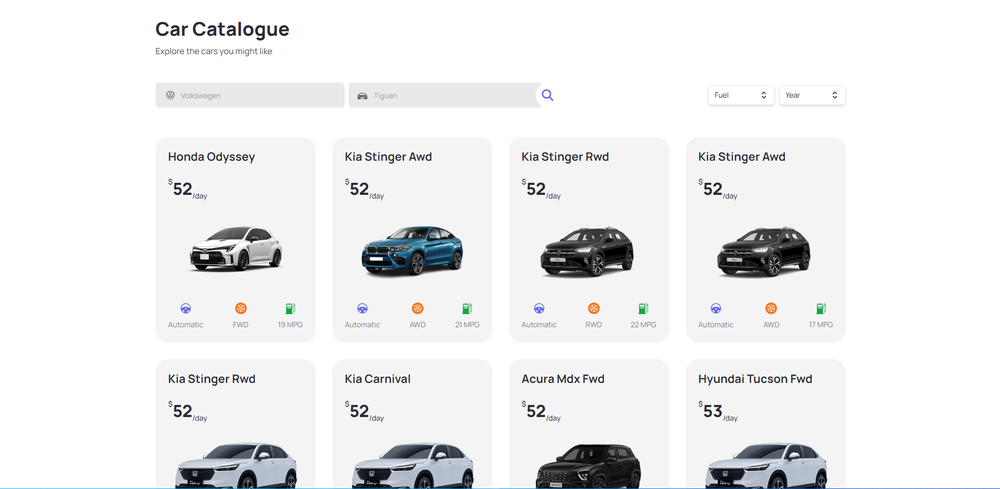

   <h1>RENT-X</h1>

 

   
    
    

 
<a href="#english"><b><i>Read it in English</i></b></a>
 
 

[**Links**](#-links) &nbsp;&nbsp;**|**&nbsp;&nbsp;
[**Projeto**](#-projeto) &nbsp;&nbsp;**|**&nbsp;&nbsp;
[**Tecnologias**](#-tecnologias) &nbsp;&nbsp;**|**&nbsp;&nbsp;
[**Instalação**](#-instalação) &nbsp;&nbsp;**|**&nbsp;&nbsp;

## 🔗 Links

O projeto pode ser visualizado através do link: <a href="https://rent-x.vercel.app/" target="_blank">**RENT-X**</a>.

## 🎮 Projeto

  

 

**RENT-X** é uma landing page para uma aplicação para aluguel de carros, foi utilizado a API Ninja Cars com o intuito de apresentar diversos tipos de marcas e modelos.

 
 

 

 

Projeto totalmente responsivo e funcional.

 

## 🚀 Tecnologias

<ul>
   <li>Typescript (https://www.typescriptlang.org/)</li>
   <li>NextJS (https://nextjs.org/)</li>
   <li>ReactJS (https://reactjs.org/)</li>
   <li>Tailwind CSS (https://tailwindcss.com/)</li>
   <li>API Ninja Cars (https://api-ninjas.com/api/cars)</li>
   <li>Headless UI (https://headlessui.com/)</li>
   <li>React Icons (https://react-icons.github.io/react-icons/)</li>
   <li>Vercel - Hospedagem Web/Server (https://vercel.com/)</li>
</ul>

## 🔧 Instalação

1. Instale o projeto rodando o comando `npm install`, `yarn install` ou `pnpm install` no seu terminal
1. Inicie o servidor da web em outro terminal, rodando `npm run dev`, `yarn dev` ou `pnpm dev` no seu terminal
1. Para utilizar o aplicativo web, basta abrir [http://localhost:3000](http://localhost:3000) em algum browser

## 💡 Contribuição

- Faça um **_fork_** desse repositório;
- Crie um **branch** para a sua feature: `git checkout -b minha-feature`;
- Faça um **commit** com suas alterações: `git commit -m 'feat: Minha nova feature'`;
- Faça um **push** para a sua branch: `git push origin minha-feature`;
- Faça um **pull request** com sua feature;

Pull requests são sempre bem-vindos. Em caso de dúvidas ou sugestões, crie uma _**issue**_ ou entre em contato comigo.

---

_English version_

 

[**Links**](#-links) &nbsp;&nbsp;**|**&nbsp;&nbsp;
[**Project**](#-project) &nbsp;&nbsp;**|**&nbsp;&nbsp;
[**Technologies**](#-technologies) &nbsp;&nbsp;**|**&nbsp;&nbsp;
[**Installation**](#-installation) &nbsp;&nbsp;**|**&nbsp;&nbsp;

## 🔗 Links

The project can be followed through the link: <a href="https://rent-x.vercel.app/" target="_blank">**RENT-X**</a>.

## 🎮 Project

  

 
 

**RENT-X** is a landing page for a car rental application, using the Ninja Cars API to present different makes and models.
 
 

 

 

Fully responsive and functional design.

 

## 🚀 Technologies

<ul>
   <li>Typescript (https://www.typescriptlang.org/)</li>
   <li>NextJS (https://nextjs.org/)</li>
   <li>ReactJS (https://reactjs.org/)</li>
   <li>Tailwind CSS (https://tailwindcss.com/)</li>
   <li>API Ninja Cars (https://api-ninjas.com/api/cars)</li>
   <li>Headless UI (https://headlessui.com/)</li>
   <li>React Icons (https://react-icons.github.io/react-icons/)</li>
   <li>Vercel - Hospedagem Web/Server (https://vercel.com/)</li>
</ul>

## 🔧 Installation

1. Install the project by running `npm install`, `yarn install` or `pnpm install` in your terminal
1. Start the web server in another terminal by running `npm run dev`, `yarn dev` or `pnpm dev`
1. To use the web application, just open [http://localhost:3000](http://localhost:3000) in some web browser

## 💡 Contribution

- Do a **_fork_** of that repository;
- Create a **branch** for your feature: `git checkout -b my-feature`;
- Make a **commit** with your changes: `git commit -m 'feat: My new feature'`;
- Make a **push** to your branch: `git push origin my-feature`;
- Make a **pull request** with your feature;

Pull requests are always welcome. If you have any questions or suggestions, please create an _**issue**_ or contact me.

---

<h5 align="center">
  &copy;2023 - <a href="https://github.com/SSilvaGustavo/">Gustavo Silva</a>
</h5>

<a href='#top'>🔼 Back to top</a>
